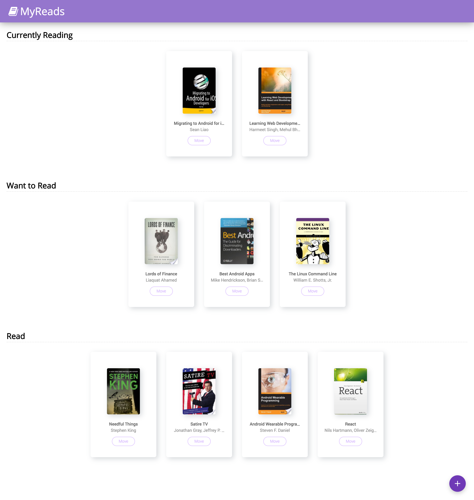

# MyReads

This is  a bookshelf app that allows you to select and categorize books you have read, 
are currently reading, or want to read.

You can also search for books, As the value of your input changes, the books that match your query
are displayed on the page, along with a control that lets you add the book to your library.

### Getting Started
   
* To install, run `npm install`
* To launch the app, run `npm start`

### Screen Shot

